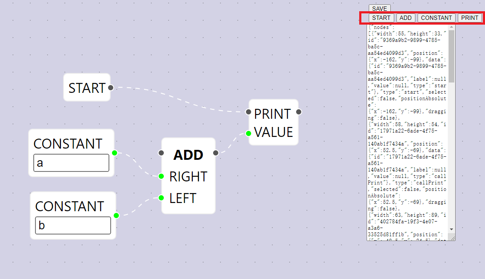
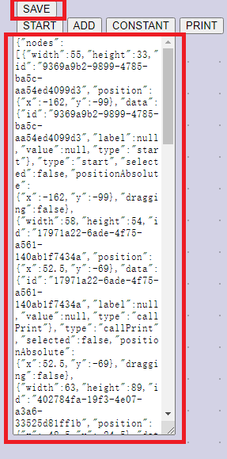
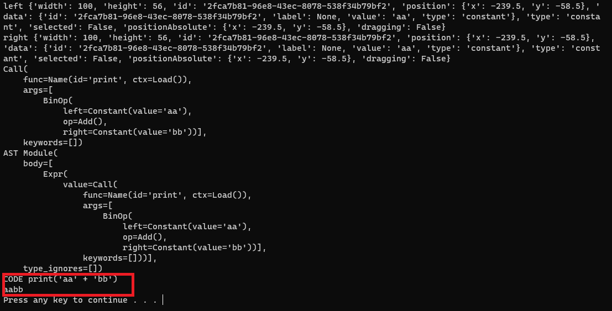

## 通过拖拽图形生成python代码

### 项目说明
source/ATS/reactproject1: react制作的图形编辑界面。使用[reactflow](https://reactflow.dev/)制作图标功能  
source/ATS/语法树: 读取reactflow的json数据文件,通过python的语法树创建python代码。

### 使用说明
#### 功能节点按钮
已经支持的节点  
**START** 开始节点  
**NAME** 变量
**ASSGIN** 赋值  
**PRINT** print函数  
**CONSTANT** 定义常量  
**COMPARE** 逻辑运算符(例如== !=)  
**BIN OP** 二元运算符(例如+ - * /)  
**IF** 条件判断语法  
**FOR** for循环  
**LIST** list数据

点击右上角的按钮可以创建对应的功能节点

将创画布上的节点链接起来，组成功能。
连接好节点后，点击右上角的 **SAVE** 按钮。会在文本框中生成节点数据。

复制文本框中的json代码保存为json文件。

打开 source/ATS/语法树/LoadJson.py文件，文件中的第9行。文件名改成上一步保存的json文件名。
`fileName = 'sample.json'`

运行这个脚本，可以在控制台看到生成的python代码和代码的运行结果。

